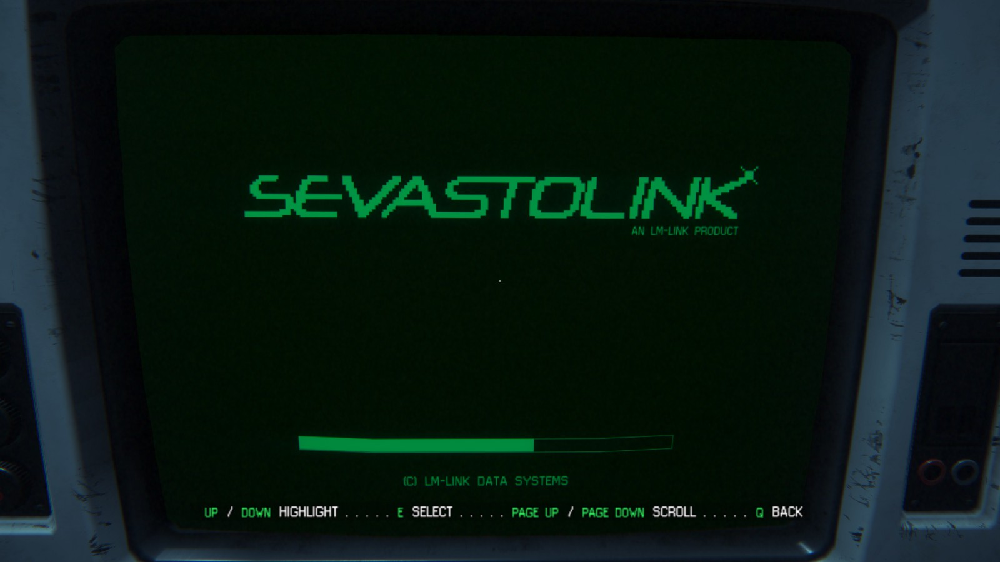
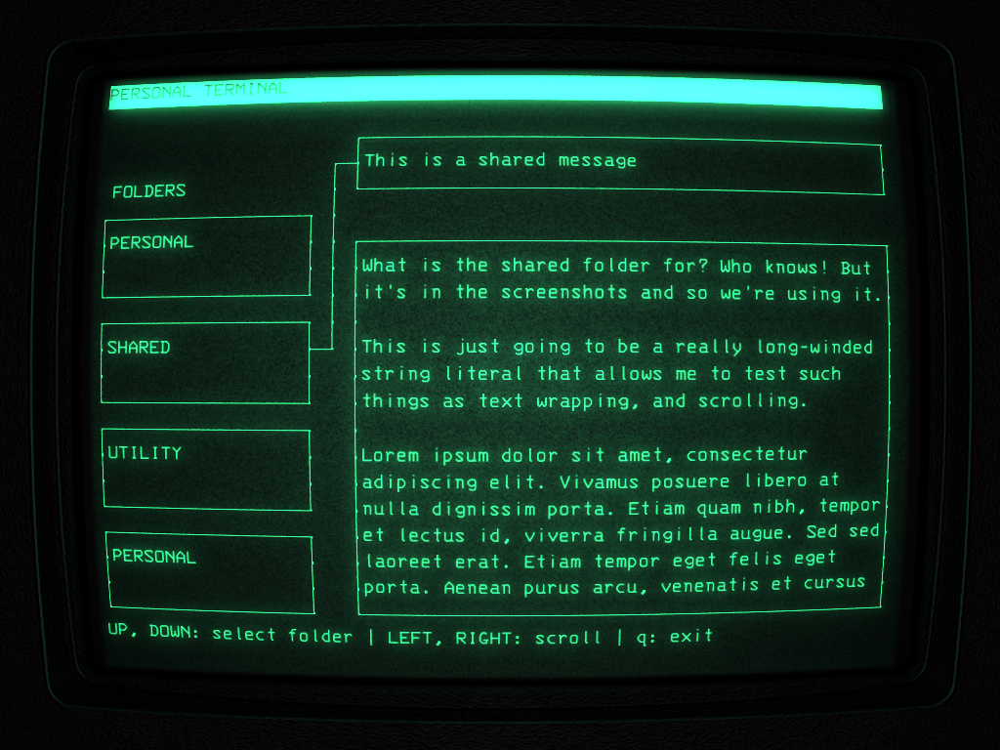
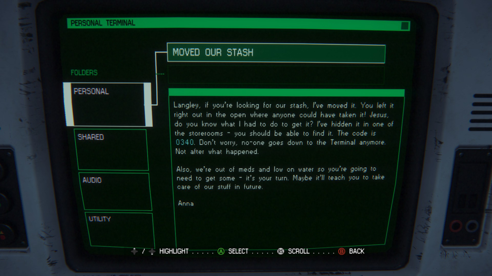

alien-console
==============

This is a ncurses-based application which emulates the terminal application
shown in Alien: Isolation. When you combine this with a terminal emulator that
focuses on a retro look (like [Cool Retro Term][]), it doesn't look that far
off!

The entries in the "Personal Terminal" screen are completely customizable, using
a configuration file located in:

- the first command line argument, OR
- `/etc/alien-console/alien-console.conf`, OR
- `/usr/share/alien-console/alien-console.conf`

See `etc/alien-console.conf` for a sample configuration file (which should be
installed at `/usr/share/alien-console`).

Screenshots
-----------

These use Cool Retro Term with a theme I came up with to match the Alien
computers.

- Splash screen:

  

  Compare to:

  

- Personal Terminal

  

  Compare to:

  

[Cool Retro Term]: https://github.com/Swordfish90/cool-retro-term

Sound
-----

This program can play sound effects at startup. If you were to find the sound
files inside Alien: Isolation which contained the startup sequence sound
effects, you could place a `wav` file at `/var/local/console.wav` and listen for
the magic. I don't want to distribute that because copyright.

Install
-------

I have created an [AUR package](https://aur.archlinux.org/alien-console) for
Arch Linux. Be sure to install `cool-retro-term` so it will look cool! My
configuration used in the screenshots can be imported from `nostromo.json`.

Etc
---

The license is Revised BSD. See `LICENSE` for more details. See the Changelog
for changes and version info.
